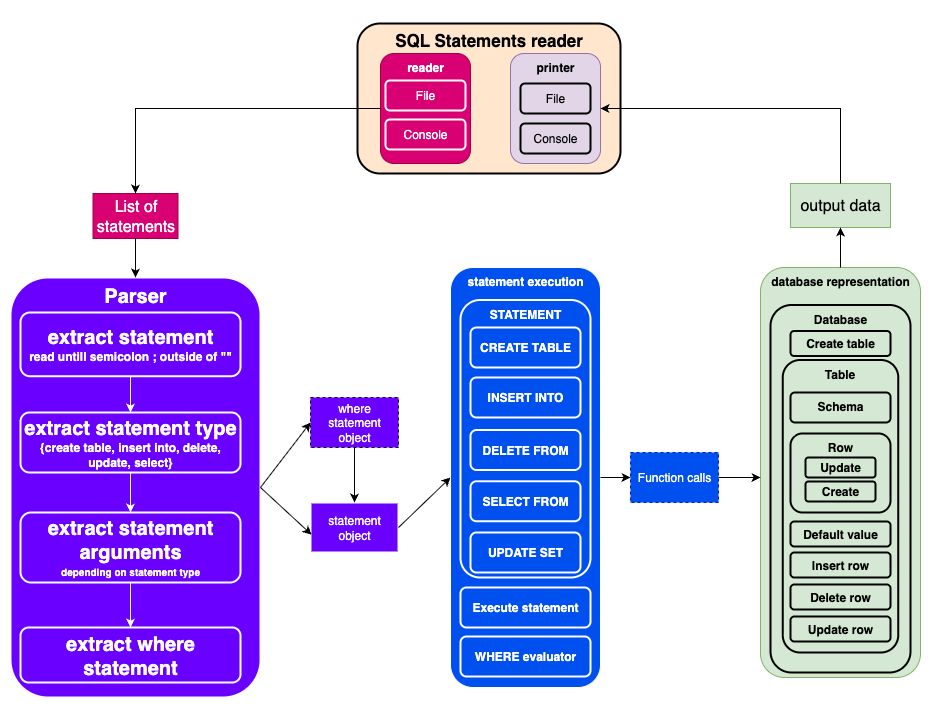
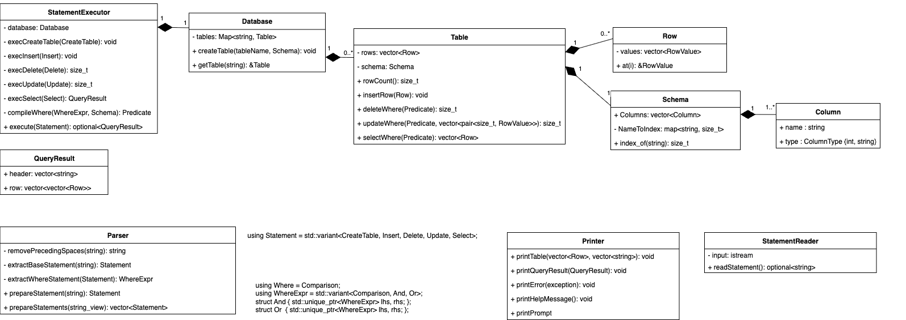

# MemoriaDB (in-memory SQL)

## How to start

### Build
```bash
mkdir cmake-build-debug
```

```bash
cmake build  cmake-build-debug
```

### Run
```bash
./cmake-build-debug/memoriadb
```

## Example usage

Example statements are stored in **tests/statements.sql**

Create table with (int/string) fields:
```bash
CREATE TABLE Users (id int, name str, age int, city str);
```

Create a table entry:
```bash
INSERT INTO Users (id, name, age, city) VALUES (1, "John", 25, "New York"), (2, "Alice", 30, "London"), (3, "Bob", 22, "Paris");
```

Select entries from table (with WHERE condition):
```bash
SELECT * FROM Users WHERE (city = "Paris" OR name = "John") AND (age = 25);
```

Delete entry from table:
```bash
DELETE FROM Users WHERE age < 25;
```

## Overview
MemoriaDB is a small in-memory database that parses a restricted SQL dialect and executes it against an internal data model. The executable reads statements from std::cin, prints SELECT results as ASCII tables to std::cout, and reports errors to std::cerr, matching the assignment requirements.



## Library core design
The core is split into three subsystems with clear responsibilities:
* **Parser**: turns text into an AST. Statements are modeled as a std::variant of CreateTable, Insert, Delete, Update, Select. WHERE conditions form a small expression tree WhereExpr = variant<Comparison, And, Or> with unique_ptr children for nodes.
* **Executor**: StatementExecutor is the façade that visits the AST (std::visit) and calls the data layer. It type-checks expressions, compiles WHERE into a std::function<bool(const Row&)>, plans projections, validates assignments, and applies side effects.
* **Data model**: Database owns named Tables. Each Table stores Rows (vector of RowValue = variant<int64_t,std::string>) and a Schema (vector of Column plus a name→index map for O(1) lookups). Mutators (insertRow, updateWhere, deleteWhere) validate arity and types against the schema. Read APIs accept a predicate and optional projection indices.

## I/O layer
StatementReader accumulates input across lines and splits on ; outside quotes/comments, enabling multi-line input and script paste. Printer renders ASCII tables with width computation and numeric alignment; it also prints errors and simple “rows affected” messages.

## Design decisions justification

The separation (Parser / Executor / Storage) keeps concerns isolated and testable. The AST prevents ad-hoc string handling during execution and enables semantic validation before mutation. A name→index map in Schema avoids linear scans during projection/updates.

## C++ features used
* std::variant/visit
* std::optional
* std::unique_ptr
* strong enum class
* move semantics
* perfect-forwarding emplace
* lambdas
* std::function (type-erased predicates)
* string_view for parsing
* exceptions for error reporting
* RAII for resource safety

## Clang formatting

Check clang formating:
```bash
 git ls-files '*.c' '*.cc' '*.cpp' '*.cxx' '*.h' '*.hh' '*.hpp' \
  | xargs clang-format -i --dry-run -style=file 
```

Tranform files to clang format:
```bash
 git ls-files '*.c' '*.cc' '*.cpp' '*.cxx' '*.h' '*.hh' '*.hpp' \
  | xargs clang-format -i -style=file 
```

## Potential improvements

Repository improvements:
1. Gmock tests
2. Valgrind tests
3. Gcov
4. Github actions CI/CD 

Feature improvements:
1. Different database engines
2. Store data as columns
3. Add b-tree